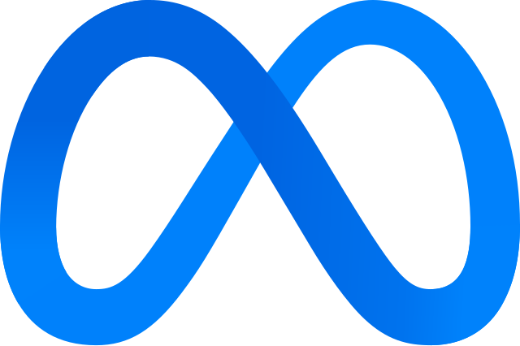
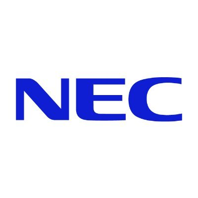

Hi, I'm Dohwan Ko, a final-year Ph.D. student at <a href="https://mlv.kaist.ac.kr/" style="color: #900023; text-decoration: none;">**Machine Learning and Vision Lab (MLV)**</a> in Korea University, under the supervision of Prof.  <a href="https://pages.cs.wisc.edu/~hwkim/" style="color: #900023; text-decoration: none;">**Hyunwoo J. Kim**</a>. 
I received my B.S. degree in Computer Science and Engineering in Korea University at Feb. 2021.
I was fortunate to gain research experience through internships at <strong>Meta Reality Labs</strong> and <strong>NEC Labs America</strong>, where my work centered on multi-modal video understanding using large language models and foundation models.
Currently, my research interest includes:
- Multi-Modal Agent AI and Reasoning
- Video Large Language Models and Foundation Models
- Efficient Multi-Modal Video Understanding

Here is my <a href="../CV.pdf" style="color: #900023; text-decoratio.n: none;">**CV**</a>.  (last update: Oct. 2025).

<strong>I’m looking for my next position in the industry starting in Spring 2026. If my profile aligns with your institution's needs, I would greatly appreciate the opportunity to connect.  Please feel free to reach out at ikodoh[AT]korea.ac.kr.</strong>

## Education
- **M.S & Ph.D** in Computer Science and Engineering at <a href="https://www.korea.edu/mbshome/mbs/en/index.do" style="color: #900023; text-decoratio.n: none;">**Korea University**</a>. \\
Mar. 2021 - Current

- **B.S.** in Computer Science and Engineering at <a href="https://www.korea.edu/mbshome/mbs/en/index.do" style="color: #900023; text-decoration.n: none;">**Korea University**</a>. \\
Mar. 2017 - Feb. 2021

## Work Experiences
-  **Meta** \\
Menlo Park, CA, USA (Mar. 2025 - Jun. 2025)  \\
Research Scientist Intern at Meta Reality Labs. 

-  **NEC Labs America** \\
San Jose, CA, USA (Jun. 2024 - Aug. 2024) \\
Research Scientist Intern at Media Analytics Team. 

-  **NAVER** \\
Seongnam, South Korea (Jul. 2020 - Aug. 2020) \\
Intern at User Feedback Platform. 

## News

  Jun. 2025&nbsp;&nbsp;
  Our paper <strong>Bidirectional Likelihood Estimation with Multi-Modal Large Language Models for Text-Video Retrieval (BLiM)</strong> has been accepted to ICCV 2025 as a <strong>Highlight</strong>! (top 9.7%)
  <!-- Our paper <strong>Bidirectional Likelihood Estimation with Multi-Modal Large Language Models for Text-Video Retrieval</strong> has been accepted to ICCV 2025 (Highlight)! -->

  Sep. 2024&nbsp;&nbsp;
  Our paper <strong>LLaMo: Large Language Model-based Molecular Graph Assistant</strong> has been accepted to NeurIPS 2024!

  Oct. 2023&nbsp;&nbsp;
  Our paper <strong>Large Language Models are Temporal and Causal Reasoners for Video Question Answering (Flipped-VQA)</strong> has been accepted to EMNLP 2023!

  Jul. 2023&nbsp;&nbsp;
  Our paper <strong>Open-vocabulary Video Question Answering (OVQA)</strong> has been accepted to ICCV 2023!

  Feb. 2023&nbsp;&nbsp;
  Our paper <strong>Meta Loss Transformer (MELTR)</strong> has been accepted to CVPR 2023!

  Nov. 2022&nbsp;&nbsp;
  Our paper <strong>Randomly Shuffled Convolution for Self-Supervised Representation Learning (Croffle)</strong> has been accepted to Information Sciences!

  Mar. 2022&nbsp;&nbsp;
  Our paper <strong>Video-Text Representation Learning via Differentiable Weak Alignment (VT-TWINS)</strong> has been accepted to CVPR 2022!

  Oct. 2021&nbsp;&nbsp;
  Our paper <strong>Search-and-Attack: Temporally Sparse Adversarial Perturbations on Videos</strong> has been accepted to IEEE Access!

