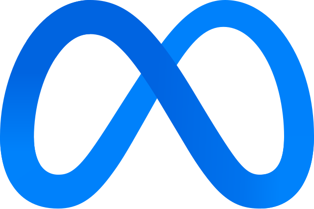
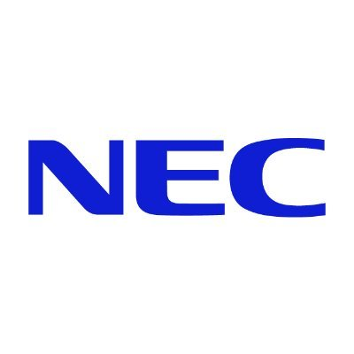

Hi, I'm Dohwan Ko, a final-year Ph.D. student at <a href="https://mlv.kaist.ac.kr/" style="color: #C1121F; text-decoration: none;">**Machine Learning and Vision Lab (MLV)**</a> in Korea University, under the supervision of Prof.  <a href="https://pages.cs.wisc.edu/~hwkim/" style="color: #C1121F; text-decoration: none;">**Hyunwoo J. Kim**</a>. 
I received my B.S. degree in Computer Science and Engineering in Korea University at Feb. 2021.
I was fortunate to gain research experience through internships at <strong>Meta Reality Labs</strong> and <strong>NEC Labs America</strong>, where my work centered on multi-modal video understanding using large language models and foundation models.
Currently, my research interest includes:
- Multi-Modal Agent AI and Reasoning
- Video Large Language Models and Foundation Models
- Efficient Multi-Modal Video Understanding

  <a class="cta-btn cta-btn--cv" href="../cv.pdf" target="_blank" rel="noopener"><svg width="15" height="15" viewBox="0 0 24 24" fill="none" stroke="currentColor" stroke-width="2" stroke-linecap="round" stroke-linejoin="round" aria-hidden="true"><path d="M14 2H6a2 2 0 0 0-2 2v16a2 2 0 0 0 2 2h12a2 2 0 0 0 2-2V8z"/><polyline points="14 2 14 8 20 8"/><line x1="16" y1="13" x2="8" y2="13"/><line x1="16" y1="17" x2="8" y2="17"/><polyline points="10 9 9 9 8 9"/></svg>CV</a>
  <a class="cta-btn cta-btn--scholar" href="https://scholar.google.com/citations?user=JoYPLHUAAAAJ&hl=en" target="_blank" rel="noopener"><svg width="15" height="15" viewBox="0 0 24 24" fill="currentColor" aria-hidden="true"><path d="M5.242 13.769L0 9.5 12 0l12 9.5-5.242 4.269C17.548 11.249 14.978 9.5 12 9.5c-2.977 0-5.548 1.748-6.758 4.269zM12 10a7 7 0 1 0 0 14 7 7 0 0 0 0-14z"/></svg>Scholar</a>
  <a class="cta-btn cta-btn--github" href="https://github.com/ikodoh" target="_blank" rel="noopener"><svg width="15" height="15" viewBox="0 0 24 24" fill="currentColor" aria-hidden="true"><path d="M12 0C5.37 0 0 5.37 0 12c0 5.31 3.435 9.795 8.205 11.385.6.105.825-.255.825-.57 0-.285-.015-1.23-.015-2.235-3.015.555-3.795-.735-4.035-1.41-.135-.345-.72-1.41-1.23-1.695-.42-.225-1.02-.78-.015-.795.945-.015 1.62.87 1.845 1.23 1.08 1.815 2.805 1.305 3.495.99.105-.78.42-1.305.765-1.605-2.67-.3-5.46-1.335-5.46-5.925 0-1.305.465-2.385 1.23-3.225-.12-.3-.54-1.53.12-3.18 0 0 1.005-.315 3.3 1.23.96-.27 1.98-.405 3-.405s2.04.135 3 .405c2.295-1.56 3.3-1.23 3.3-1.23.66 1.65.24 2.88.12 3.18.765.84 1.23 1.905 1.23 3.225 0 4.605-2.805 5.625-5.475 5.925.435.375.81 1.095.81 2.22 0 1.605-.015 2.895-.015 3.3 0 .315.225.69.825.57A12.02 12.02 0 0 0 24 12c0-6.63-5.37-12-12-12z"/></svg>GitHub</a>
  <a class="cta-btn cta-btn--linkedin" href="https://www.linkedin.com/in/dohwan-ko-4b232a14b" target="_blank" rel="noopener"><svg width="15" height="15" viewBox="0 0 24 24" fill="currentColor" aria-hidden="true"><path d="M20.447 20.452h-3.554v-5.569c0-1.328-.027-3.037-1.852-3.037-1.853 0-2.136 1.445-2.136 2.939v5.667H9.351V9h3.414v1.561h.046c.477-.9 1.637-1.85 3.37-1.85 3.601 0 4.267 2.37 4.267 5.455v6.286zM5.337 7.433a2.062 2.062 0 0 1-2.063-2.065 2.064 2.064 0 1 1 2.063 2.065zm1.782 13.019H3.555V9h3.564v11.452zM22.225 0H1.771C.792 0 0 .774 0 1.729v20.542C0 23.227.792 24 1.771 24h20.451C23.2 24 24 23.227 24 22.271V1.729C24 .774 23.2 0 22.222 0h.003z"/></svg>LinkedIn</a>

<strong>I’m looking for my next position in the industry starting in 2027. If my profile aligns with your institution's needs, I would greatly appreciate the opportunity to connect.  Please feel free to reach out at ikodoh[AT]korea.ac.kr.</strong>

<h2 class="section-title">🎓Education</h2>
- **M.S & Ph.D** in Computer Science and Engineering at <a href="https://www.korea.edu/mbshome/mbs/en/index.do" style="color: #C1121F; text-decoratio.n: none;">**Korea University**</a>. \\
Mar. 2021 -- Feb. 2027 (expected)

- **B.S.** in Computer Science and Engineering at <a href="https://www.korea.edu/mbshome/mbs/en/index.do" style="color: #C1121F; text-decoration.n: none;">**Korea University**</a>. \\
Mar. 2017 -- Feb. 2021

<h2 class="section-title">🗂️Work Experiences</h2>
-  **Meta** \\
Menlo Park, CA, USA (April 2026 -- Jul. 2026)  \\
Research Scientist Intern at Meta Reality Labs. 

-  **Meta** \\
Menlo Park, CA, USA (Mar. 2025 -- Jun. 2025)  \\
Research Scientist Intern at Meta Reality Labs. 

-  **NEC Labs America** \\
San Jose, CA, USA (Jun. 2024 -- Aug. 2024) \\
Research Scientist Intern at Media Analytics Team. 

-  **NAVER** \\
Seongnam, South Korea (Jul. 2020 -- Aug. 2020) \\
Intern at User Feedback Platform. 

<h2 class="section-title">🔥News</h2>

  Aug. 2026&nbsp;&nbsp;
  Our paper <strong>SVMemAgent: A Streaming Video Memory Agent for Query-Agnostic Online Frame Selection</strong> has been accepted to the Wearable AI Workshop at ECCV 2026!

  Jul. 2026&nbsp;&nbsp;
  Our paper <strong>VideoSearch-R1: Iterative Video Retrieval and Reasoning via Soft Query Refinement</strong> has been accepted to ECCV 2026!

  Feb. 2026&nbsp;&nbsp;
  Two papers, <strong>MoE-GRPO</strong> and <strong>DocPrune</strong>, have been accepted to CVPR 2026!

  Jun. 2025&nbsp;&nbsp;
  Our paper <strong>Bidirectional Likelihood Estimation with Multi-Modal Large Language Models for Text-Video Retrieval (BLiM)</strong> has been accepted to ICCV 2025 as a <strong>Highlight</strong>! (top 9.7%)

  Sep. 2024&nbsp;&nbsp;
  Our paper <strong>LLaMo: Large Language Model-based Molecular Graph Assistant</strong> has been accepted to NeurIPS 2024!

  Oct. 2023&nbsp;&nbsp;
  Our paper <strong>Large Language Models are Temporal and Causal Reasoners for Video Question Answering (Flipped-VQA)</strong> has been accepted to EMNLP 2023!

  Jul. 2023&nbsp;&nbsp;
  Our paper <strong>Open-vocabulary Video Question Answering (OVQA)</strong> has been accepted to ICCV 2023!

  Feb. 2023&nbsp;&nbsp;
  Our paper <strong>Meta Loss Transformer (MELTR)</strong> has been accepted to CVPR 2023!

  Nov. 2022&nbsp;&nbsp;
  Our paper <strong>Randomly Shuffled Convolution for Self-Supervised Representation Learning (Croffle)</strong> has been accepted to Information Sciences!

  Mar. 2022&nbsp;&nbsp;
  Our paper <strong>Video-Text Representation Learning via Differentiable Weak Alignment (VT-TWINS)</strong> has been accepted to CVPR 2022!

  Oct. 2021&nbsp;&nbsp;
  Our paper <strong>Search-and-Attack: Temporally Sparse Adversarial Perturbations on Videos</strong> has been accepted to IEEE Access!

