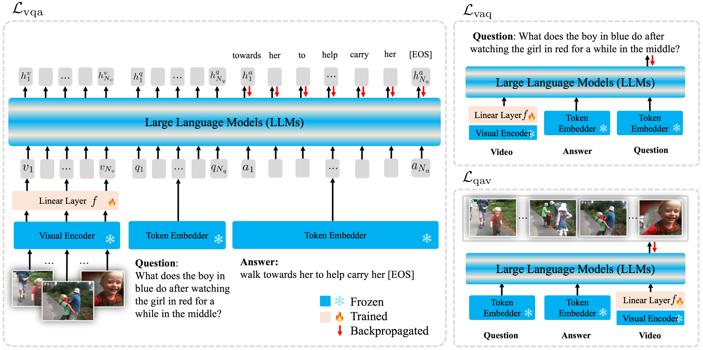

## International Conference Publications

	

		
	

  

    <strong>Large Language Models are Temporal and Causal Reasoners for Video Question Answering</strong>  
    <u><strong>Dohwan Ko</strong></u>*, Ji Soo Lee*, Wooyoung Kang, Byungseok Roh, Hyunwoo J. Kim 
    
<strong>EMNLP 2023 Main</strong>

    <a href="https://arxiv.org/abs/2310.15747"><button type="button" style="color: #fff; background-color: rgb(139, 193, 229); border-color: transparent;" class="btn btn-primary btn-sm">arxiv</button></a>
    <a href="https://github.com/mlvlab/Flipped-VQA"><button type="button" style="color: #fff; background-color: #95ADB6; border-color: transparent;" class="btn btn-primary btn-sm">code</button></a>
    <a href="vidchapters.html"><button type="button" style="color: #fff; background-color: rgb(139, 229, 154); border-color: transparent;" class="btn btn-primary btn-sm">project page</button></a>
    <button type="button" style="color: #fff; background-color: #DBC7BE; border-color: transparent;" class="btn btn-primary btn-sm" data-toggle="collapse" data-target="#bibtex9">bibtex</button>
      

        <pre><tt>@inproceedings{ko2023large,
        title={Large Language Models are Temporal and Causal Reasoners for Video Question Answering},
        author={Dohwan Ko and Ji Soo Lee and Wooyoung Kang and Byungseok Roh and Hyunwoo J. Kim},
        booktitle={EMNLP},
        year = {2023}}</tt></pre>
      

    
  

	

		
	

  

    <strong>Open-Vocabulary Video Question Answering: A New Benchmark for Evaluating the Generalizability of Video Question Answering Models</strong>  
    <u><strong>Dohwan Ko</strong></u>, Ji Soo Lee, Miso Choi, Jaewon Chu, Jihwan Park, Hyunwoo J. Kim 
    
<strong>ICCV 2023</strong>

    <a href="https://arxiv.org/abs/2308.09363"><button type="button" style="color: #fff; background-color: rgb(139, 193, 229); border-color: transparent;" class="btn btn-primary btn-sm">arxiv</button></a>
    <a href="https://github.com/mlvlab/OVQA"><button type="button" style="color: #fff; background-color: #95ADB6; border-color: transparent;" class="btn btn-primary btn-sm">code</button></a>
    <button type="button" style="color: #fff; background-color: #DBC7BE; border-color: transparent;" class="btn btn-primary btn-sm" data-toggle="collapse" data-target="#bibtex9">bibtex</button>
      

        <pre><tt>@inproceedings{ko2023large,
        title={Large Language Models are Temporal and Causal Reasoners for Video Question Answering},
        author={Dohwan Ko and Ji Soo Lee and Wooyoung Kang and Byungseok Roh and Hyunwoo J. Kim},
        booktitle={EMNLP},
        year = {2023}}</tt></pre>
      

    
  

- **Concept Bottleneck with Visual Concept Filtering for Explainable Medical Image Classification** \\
[[paper]](https://arxiv.org/abs/2308.11920) [code] \\
Injae Kim\*, <b>Jongha Kim</b>\*, Joonmyung Choi, Hyunwoo J. Kim\\
**MICCAI Workshop** 2023, 1st International Workshop on Foundation Models for General Medical AI

- **Object Detection in Aerial Images with Uncertainty-Aware Graph Network** \\
[[paper]](https://arxiv.org/abs/2208.10781) [code] \\
<b>Jongha Kim</b>, Jinheon Baek, Sung Ju Hwang\\
**ECCV Workshop** 2022, The first workshop on Visual Object-oriented Learning meets Interaction (VOLI): Discovery, Representations, and Applications

## Domestic Conference Publication
- **A study on the Measurement System of Apple Sugar Content Based on Smartphone Camera** \\
Sanghoon Lee, <b>Jongha Kim</b>, Hyemin Song and Hyun Kim \\
Autumn Annual Conference of IEIE (The Institute of Electronics and Information Engineers) 2019