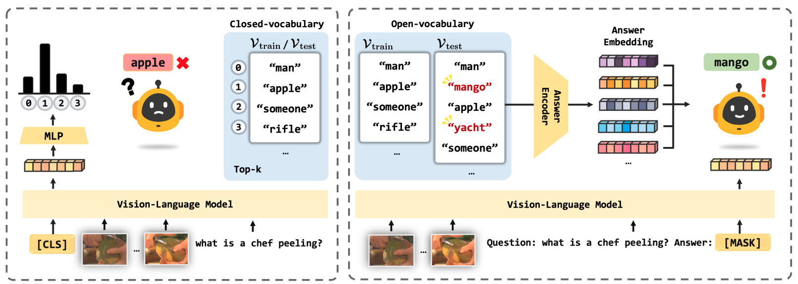
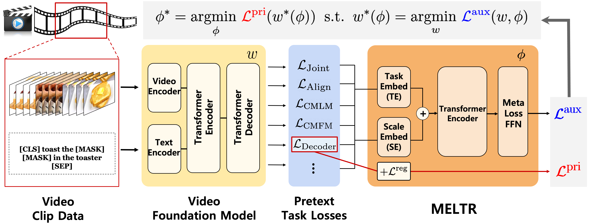
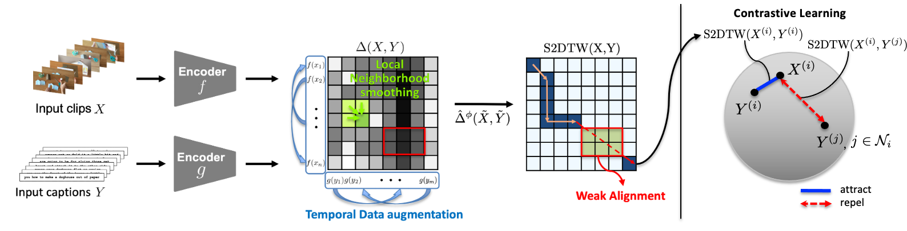
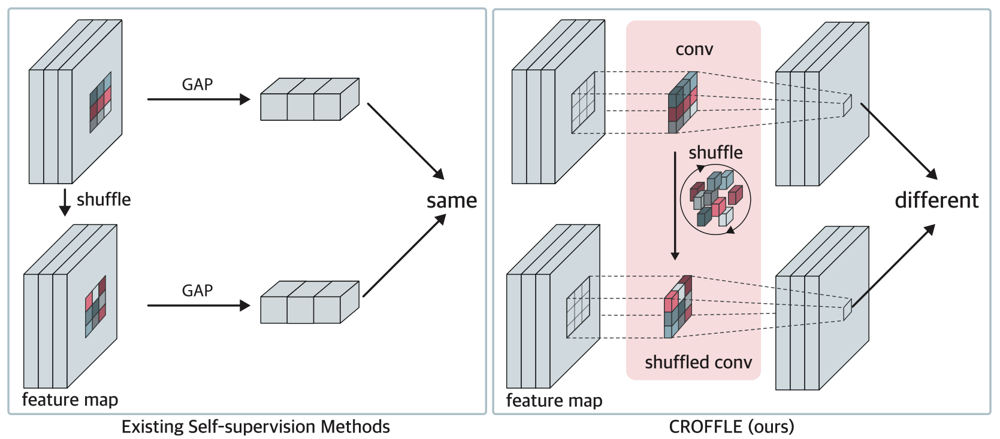
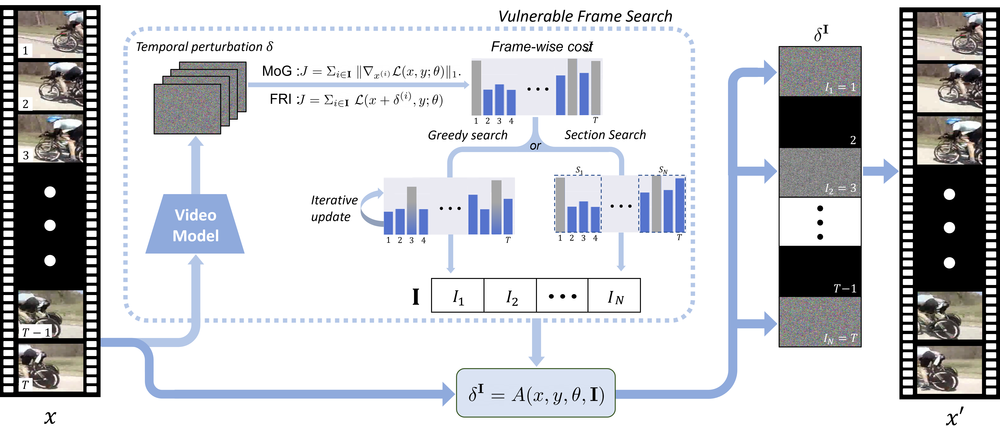

## International Conference Publications

	

		
	

  

    <strong>Large Language Models are Temporal and Causal Reasoners for Video Question Answering</strong>  
    <u><strong>Dohwan Ko</strong></u>*, Ji Soo Lee*, Wooyoung Kang, Byungseok Roh, Hyunwoo J. Kim 
    
<strong>EMNLP 2023 Main</strong>

    <a href="https://arxiv.org/abs/2310.15747"><button type="button" style="color: #fff; background-color: rgb(139, 193, 229); border-color: transparent;" class="btn btn-primary btn-sm">arxiv</button></a>
    <a href="https://github.com/mlvlab/Flipped-VQA"><button type="button" style="color: #fff; background-color: #95ADB6; border-color: transparent;" class="btn btn-primary btn-sm">code</button></a>
    <a href="../flipped_vqa.html"><button type="button" style="color: #fff; background-color: rgb(139, 229, 154); border-color: transparent;" class="btn btn-primary btn-sm">project page</button></a>
    <button type="button" style="color: #fff; background-color: #DBC7BE; border-color: transparent;" class="btn btn-primary btn-sm" data-toggle="collapse" data-target="#emnlp2023">bibtex</button>
      

        <pre><tt>@inproceedings{ko2023large,
        title={Large Language Models are Temporal and Causal Reasoners for Video Question Answering},
        author={Dohwan Ko and Ji Soo Lee and Wooyoung Kang and Byungseok Roh and Hyunwoo J. Kim},
        booktitle={EMNLP},
        year={2023}}</tt></pre>
      

    
  

	

		
	

  

    <strong>Open-Vocabulary Video Question Answering: A New Benchmark for Evaluating the Generalizability of Video Question Answering Models</strong>  
    <u><strong>Dohwan Ko</strong></u>, Ji Soo Lee, Miso Choi, Jaewon Chu, Jihwan Park, Hyunwoo J. Kim 
    
<strong>ICCV 2023</strong>

    <a href="https://arxiv.org/abs/2308.09363"><button type="button" style="color: #fff; background-color: rgb(139, 193, 229); border-color: transparent;" class="btn btn-primary btn-sm">arxiv</button></a>
    <a href="https://github.com/mlvlab/OVQA"><button type="button" style="color: #fff; background-color: #95ADB6; border-color: transparent;" class="btn btn-primary btn-sm">code</button></a>
    <button type="button" style="color: #fff; background-color: #DBC7BE; border-color: transparent;" class="btn btn-primary btn-sm" data-toggle="collapse" data-target="#iccv2023">bibtex</button>
      

        <pre><tt>@inproceedings{ko2023open,
        title={Open-vocabulary Video Question Answering: A New Benchmark for Evaluating the Generalizability of Video Question Answering Models},
        author={Ko, Dohwan and Lee, Ji Soo and Choi, Miso and Chu, Jaewon and Park, Jihwan and Kim, Hyunwoo J},
        booktitle={ICCV},
        year={2023}}</tt></pre>
      

    
  

	

		
	

  

    <strong>MELTR: Meta Loss Transformer for Learning to Fine-tune Video Foundation Models</strong>  
    <u><strong>Dohwan Ko</strong></u>*, Joonmyung Choi*, Hyeong Kyu Choi, Kyoung-Woon On, Byungseok Roh, Hyunwoo J. Kim 
    
<strong>CVPR 2023</strong>

    <a href="https://arxiv.org/abs/2303.13009"><button type="button" style="color: #fff; background-color: rgb(139, 193, 229); border-color: transparent;" class="btn btn-primary btn-sm">arxiv</button></a>
    <a href="https://github.com/mlvlab/MELTR"><button type="button" style="color: #fff; background-color: #95ADB6; border-color: transparent;" class="btn btn-primary btn-sm">code</button></a>
    <button type="button" style="color: #fff; background-color: #DBC7BE; border-color: transparent;" class="btn btn-primary btn-sm" data-toggle="collapse" data-target="#cvpr2023">bibtex</button>
      

        <pre><tt>@inproceedings{ko2023melrt,
        title={MELTR: Meta Loss Transformer for Learning to Fine-tune Video Foundation Models},
        author={Ko, Dohwan and Choi, Joonmyung and Choi, Hyeong Kyu and On, Kyoung-Woon and Roh, Byungseok and Kim, Hyunwoo J},
        booktitle={CVPR},
        year={2023}}</tt></pre>
      

    
  

	

		
	

  

    <strong>Video-Text Representation Learning via Differentiable Weak Temporal Alignment</strong>  
    <u><strong>Dohwan Ko</strong></u>, Joonmyung Choi, Juyeon Ko, Shinyeong Noh, Kyoung-Woon On, Eun-Sol Kim, Hyunwoo J. Kim 
    
<strong>CVPR 2022</strong>

    <a href="https://arxiv.org/abs/2203.16784"><button type="button" style="color: #fff; background-color: rgb(139, 193, 229); border-color: transparent;" class="btn btn-primary btn-sm">arxiv</button></a>
    <a href="https://github.com/mlvlab/VT-TWINS"><button type="button" style="color: #fff; background-color: #95ADB6; border-color: transparent;" class="btn btn-primary btn-sm">code</button></a>
    <button type="button" style="color: #fff; background-color: #DBC7BE; border-color: transparent;" class="btn btn-primary btn-sm" data-toggle="collapse" data-target="#cvpr2022">bibtex</button>
      

        <pre><tt>@inproceedings{ko2022video,
        title={Video-Text Representation Learning via Differentiable Weak Temporal Alignment},
        author={Ko, Dohwan and Choi, Joonmyung and Ko, Juyeon and Noh, Shinyeong and On, Kyoung-Woon and Kim, Eun-Sol and Kim, Hyunwoo J},
        booktitle={CVPR},
        year={2022}}</tt></pre>
      

    
  

## International Journal Publications

	

		
	

  

    <strong>Randomly Shuffled Convolution for Self-Supervised Representation Learning</strong>  
    Youngjin Oh*, Minkyu Jeon*, <u><strong>Dohwan Ko</strong></u>, Hyunwoo J. Kim 
    
<strong>Information Sciences 2023</strong>

    <a href="https://www.sciencedirect.com/science/article/pii/S0020025522013032"><button type="button" style="color: #fff; background-color: rgb(139, 193, 229); border-color: transparent;" class="btn btn-primary btn-sm">paper</button></a>
    <button type="button" style="color: #fff; background-color: #DBC7BE; border-color: transparent;" class="btn btn-primary btn-sm" data-toggle="collapse" data-target="#info2023">bibtex</button>
      

        <pre><tt>@article{oh2023randomly,
        title={Randomly shuffled convolution for self-supervised representation learning},
        author={Oh, Youngjin and Jeon, Minkyu and Ko, Dohwan and Kim, Hyunwoo J},
        journal={Information Sciences},
        year={2023}}</tt></pre>
      

    
  

	

		
	

  

    <strong>Search-and-Attack: Temporally SparseAdversarial Perturbations on Videos</strong> 
    Hwan Heo*, <u><strong>Dohwan Ko</strong></u>*, Jaewon Lee*, Youngjoon Hong, Hyunwoo J. Kim 
    
<strong>IEEE Access 2021</strong>

    <a href="https://ieeexplore.ieee.org/stamp/stamp.jsp?tp=&arnumber=9592758&tag=1"><button type="button" style="color: #fff; background-color: rgb(139, 193, 229); border-color: transparent;" class="btn btn-primary btn-sm">paper</button></a>
    <button type="button" style="color: #fff; background-color: #DBC7BE; border-color: transparent;" class="btn btn-primary btn-sm" data-toggle="collapse" data-target="#access2021">bibtex</button>
      

        <pre><tt>@article{heo2021search,
        title={Search-and-attack: temporally sparse adversarial perturbations on videos},
        author={Heo, Hwan and Ko, Dohwan and Lee, Jaewon and Hong, Youngjoon and Kim, Hyunwoo J},
        journal={IEEE Access},
        year={2021}}</tt></pre>
      

    
  

