

  <h2 class="pub-section__title">
    📖
    International Conference Publications
    
  </h2>
  

* denotes equal contribution.

  

    

      

        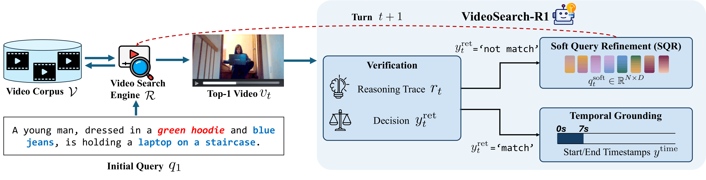
      

    

    

      <h3 class="pub-title">VideoSearch-R1: Iterative Video Retrieval and Reasoning via Soft Query Refinement</h3>
      
Seohyun Lee*, Seoung Choi*, Dohwan Ko*, Jongha Kim, Hyunwoo J. Kim

      
ECCV 2026

      

        <a class="pub-btn pub-btn--arxiv" href="https://arxiv.org/abs/2607.00446">arxiv</a>
        <a class="pub-btn pub-btn--code" href="https://github.com/mlvlab/VideoSearch-R1">code</a>
        <a class="pub-btn pub-btn--project" href="https://mlvlab.github.io/VideoSearch-R1" target="_blank">project page</a>
        <button type="button" class="pub-btn pub-btn--bibtex" data-toggle="collapse" data-target="#eccv2026" aria-expanded="false" aria-controls="eccv2026">bibtex</button>
      

      

        <pre><tt>@inproceedings{lee2026videosearchr1,
  title={VideoSearch-R1: Iterative Video Retrieval and Reasoning via Soft Query Refinement},
  author={Lee, Seohyun and Choi, Seoung and Ko, Dohwan and Kim, Jongha and Kim, Hyunwoo J.},
  booktitle={ECCV},
  year={2026}
}</tt></pre>
      

    

  

  

    

      

        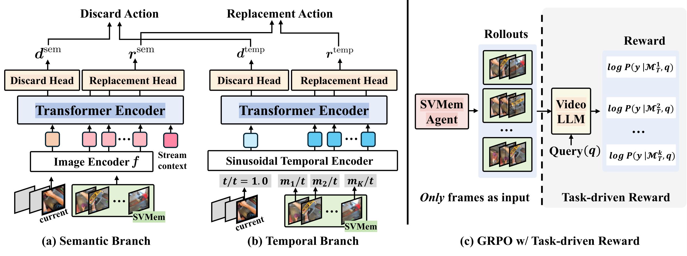
      

    

    

      <h3 class="pub-title">SVMemAgent: A Streaming Video Memory Agent for Query-Agnostic Online Frame Selection</h3>
      
Dohwan Ko, Ji Soo Lee, Pierce Chuang, Debojeet Chatterjee, Ashish Shenoy, Yichao Lu, Shane Moon, Luna Dong, Vikas Bhardwaj, Hyunwoo J. Kim

      
ECCVW 2026 Wearable AI Workshop

      

        <a class="pub-btn pub-btn--arxiv" href="https://arxiv.org/abs/2609.18540">arxiv</a>
        <button type="button" class="pub-btn pub-btn--bibtex" data-toggle="collapse" data-target="#eccvw2026" aria-expanded="false" aria-controls="eccvw2026">bibtex</button>
      

      

        <pre><tt>@inproceedings{ko2026svmemagent,
  title={SVMemAgent: A Streaming Video Memory Agent for Query-Agnostic Online Frame Selection},
  author={Ko, Dohwan and Lee, Ji Soo and Chuang, Pierce and Chatterjee, Debojeet and Shenoy, Ashish and Lu, Yichao and Moon, Shane and Dong, Luna and Bhardwaj, Vikas and Kim, Hyunwoo J.},
  booktitle={ECCVW},
  year={2026}
}</tt></pre>
      

    

  

  

    

      

        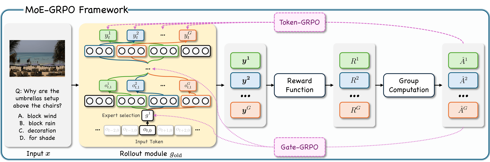
      

    

    

      <h3 class="pub-title">MoE-GRPO: Optimizing Mixture-of-Experts via Reinforcement Learning in Vision-Language Models</h3>
      
Dohwan Ko, Jinyoung Park, Seoung Choi, Sanghyeok Lee, Seohyun Lee, Hyunwoo J. Kim

      
CVPR 2026

      

        <a class="pub-btn pub-btn--arxiv" href="https://arxiv.org/abs/2603.24984">arxiv</a>
        <button type="button" class="pub-btn pub-btn--bibtex" data-toggle="collapse" data-target="#cvpr2026a" aria-expanded="false" aria-controls="cvpr2026a">bibtex</button>
      

      

        <pre><tt>@inproceedings{ko2026moe,
  title={MoE-GRPO: Optimizing Mixture-of-Experts via Reinforcement Learning in Vision-Language Models},
  author={Ko, Dohwan and Park, Jinyoung and Choi, Seoung and Lee, Sanghyeok and Lee, Seohyun and Kim, Hyunwoo J},
  booktitle={CVPR},
  year={2026}
}</tt></pre>
      

    

  

  

    

      

        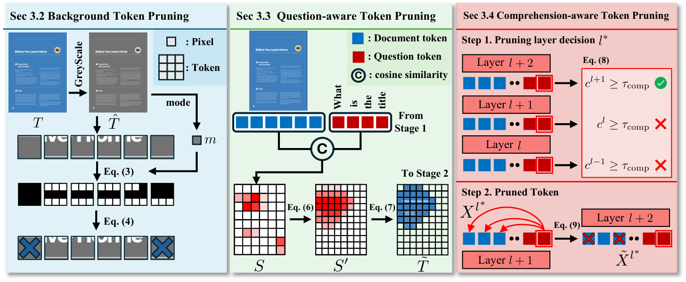
      

    

    

      <h3 class="pub-title">DocPrune: Efficient Document Question Answering via Background, Question, and Comprehension-aware Token Pruning</h3>
      
Joonmyung Choi, Sanghyeok Lee, Jongha Kim, Sehyung Kim, Dohwan Ko, Jihyung Kil, Hyunwoo J. Kim

      
CVPR 2026

      

        <a class="pub-btn pub-btn--arxiv" href="https://arxiv.org/abs/2604.22281">arxiv</a>
        <button type="button" class="pub-btn pub-btn--bibtex" data-toggle="collapse" data-target="#cvpr2026b" aria-expanded="false" aria-controls="cvpr2026b">bibtex</button>
      

      

        <pre><tt>@inproceedings{choi2026docprune,
  title={DocPrune: Efficient Document Question Answering via Background, Question, and Comprehension-aware Token Pruning},
  author={Choi, Joonmyung and Lee, Sanghyeok and Kim, Jongha and Kim, Sehyung and Ko, Dohwan and Kil, Jihyung and Kim, Hyunwoo J},
  booktitle={CVPR},
  year={2026}
}</tt></pre>
      

    

  

  

    

      

        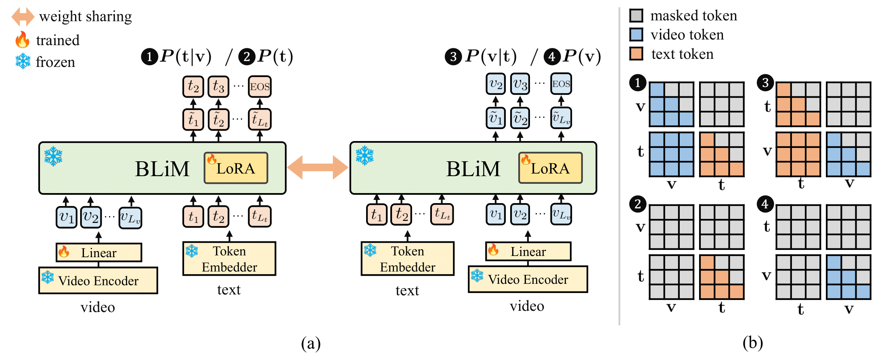
      

    

    

      <h3 class="pub-title">Bidirectional Likelihood Estimation with Multi-Modal Large Language Models for Text-Video Retrieval</h3>
      
Dohwan Ko*, Ji Soo Lee*, Minhyuk Choi, Zihang Meng, Hyunwoo J. Kim

      
ICCV 2025 Highlight &middot; top 9.7%

      

        <a class="pub-btn pub-btn--arxiv" href="https://arxiv.org/abs/2507.23284">arxiv</a>
        <a class="pub-btn pub-btn--code" href="https://github.com/mlvlab/BLiM">code</a>
        <a class="pub-btn pub-btn--project" href="../projects/BLiM" target="_blank">project page</a>
        <button type="button" class="pub-btn pub-btn--bibtex" data-toggle="collapse" data-target="#iccv2025" aria-expanded="false" aria-controls="iccv2025">bibtex</button>
      

      

        <pre><tt>@inproceedings{ko2025bidirectional,
  title={Bidirectional Likelihood Estimation with Multi-Modal Large Language Models for Text-Video Retrieval},
  author={Ko, Dohwan and Lee, Ji Soo and Choi, Minhyuk and Meng, Zihang and Kim, Hyunwoo J},
  booktitle={ICCV},
  year={2025}
}</tt></pre>
      

    

  

  

    

      

        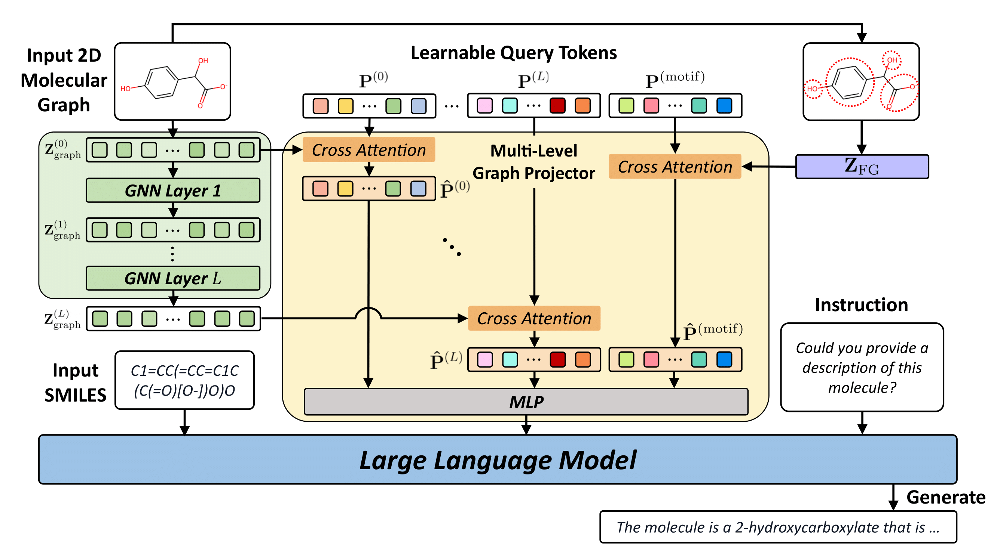
      

    

    

      <h3 class="pub-title">LLaMo: Large Language Model-based Molecular Graph Assistant</h3>
      
Jinyoung Park, Minseong Bae, Dohwan Ko, Hyunwoo J. Kim

      
NeurIPS 2024

      

        <a class="pub-btn pub-btn--arxiv" href="https://arxiv.org/abs/2411.00871">arxiv</a>
        <a class="pub-btn pub-btn--code" href="https://github.com/mlvlab/LLaMo">code</a>
        <button type="button" class="pub-btn pub-btn--bibtex" data-toggle="collapse" data-target="#neurips2024" aria-expanded="false" aria-controls="neurips2024">bibtex</button>
      

      

        <pre><tt>@inproceedings{park2024llamo,
  title={LLaMo: Large Language Model-based Molecular Graph Assistant},
  author={Park, Jinyoung and Bae, Minseong and Ko, Dohwan and Kim, Hyunwoo J},
  booktitle={NeurIPS},
  year={2024}
}</tt></pre>
      

    

  

  

    

      

        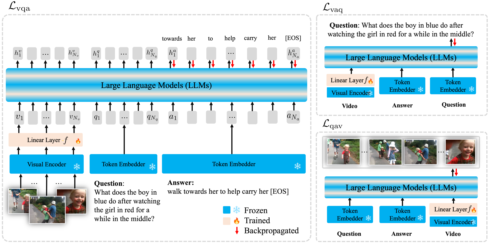
      

    

    

      <h3 class="pub-title">Large Language Models are Temporal and Causal Reasoners for Video Question Answering</h3>
      
Dohwan Ko*, Ji Soo Lee*, Wooyoung Kang, Byungseok Roh, Hyunwoo J. Kim

      
EMNLP 2023 Main

      

        <a class="pub-btn pub-btn--arxiv" href="https://arxiv.org/abs/2310.15747">arxiv</a>
        <a class="pub-btn pub-btn--code" href="https://github.com/mlvlab/Flipped-VQA">code</a>
        <a class="pub-btn pub-btn--project" href="../projects/Flipped-VQA" target="_blank">project page</a>
        <button type="button" class="pub-btn pub-btn--bibtex" data-toggle="collapse" data-target="#emnlp2023" aria-expanded="false" aria-controls="emnlp2023">bibtex</button>
      

      

        <pre><tt>@inproceedings{ko2023large,
  title={Large Language Models are Temporal and Causal Reasoners for Video Question Answering},
  author={Dohwan Ko and Ji Soo Lee and Wooyoung Kang and Byungseok Roh and Hyunwoo J. Kim},
  booktitle={EMNLP},
  year={2023}
}</tt></pre>
      

    

  

  

    

      

        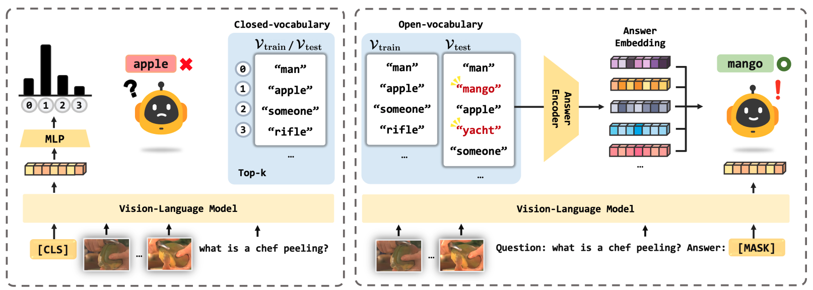
      

    

    

      <h3 class="pub-title">Open-Vocabulary Video Question Answering: A New Benchmark for Evaluating the Generalizability of Video Question Answering Models</h3>
      
Dohwan Ko, Ji Soo Lee, Miso Choi, Jaewon Chu, Jihwan Park, Hyunwoo J. Kim

      
ICCV 2023

      

        <a class="pub-btn pub-btn--arxiv" href="https://arxiv.org/abs/2308.09363">arxiv</a>
        <a class="pub-btn pub-btn--code" href="https://github.com/mlvlab/OVQA">code</a>
        <button type="button" class="pub-btn pub-btn--bibtex" data-toggle="collapse" data-target="#iccv2023" aria-expanded="false" aria-controls="iccv2023">bibtex</button>
      

      

        <pre><tt>@inproceedings{ko2023open,
  title={Open-vocabulary Video Question Answering: A New Benchmark for Evaluating the Generalizability of Video Question Answering Models},
  author={Ko, Dohwan and Lee, Ji Soo and Choi, Miso and Chu, Jaewon and Park, Jihwan and Kim, Hyunwoo J},
  booktitle={ICCV},
  year={2023}
}</tt></pre>
      

    

  

  

    

      

        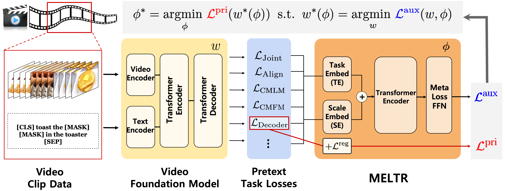
      

    

    

      <h3 class="pub-title">MELTR: Meta Loss Transformer for Learning to Fine-tune Video Foundation Models</h3>
      
Dohwan Ko*, Joonmyung Choi*, Hyeong Kyu Choi, Kyoung-Woon On, Byungseok Roh, Hyunwoo J. Kim

      
CVPR 2023

      

        <a class="pub-btn pub-btn--arxiv" href="https://arxiv.org/abs/2303.13009">arxiv</a>
        <a class="pub-btn pub-btn--code" href="https://github.com/mlvlab/MELTR">code</a>
        <button type="button" class="pub-btn pub-btn--bibtex" data-toggle="collapse" data-target="#cvpr2023" aria-expanded="false" aria-controls="cvpr2023">bibtex</button>
      

      

        <pre><tt>@inproceedings{ko2023melrt,
  title={MELTR: Meta Loss Transformer for Learning to Fine-tune Video Foundation Models},
  author={Ko, Dohwan and Choi, Joonmyung and Choi, Hyeong Kyu and On, Kyoung-Woon and Roh, Byungseok and Kim, Hyunwoo J},
  booktitle={CVPR},
  year={2023}
}</tt></pre>
      

    

  

  

    

      

        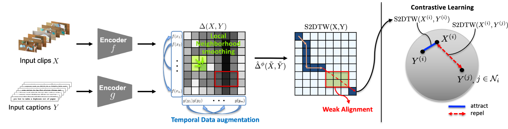
      

    

    

      <h3 class="pub-title">Video-Text Representation Learning via Differentiable Weak Temporal Alignment</h3>
      
Dohwan Ko, Joonmyung Choi, Juyeon Ko, Shinyeong Noh, Kyoung-Woon On, Eun-Sol Kim, Hyunwoo J. Kim

      
CVPR 2022

      

        <a class="pub-btn pub-btn--arxiv" href="https://arxiv.org/abs/2203.16784">arxiv</a>
        <a class="pub-btn pub-btn--code" href="https://github.com/mlvlab/VT-TWINS">code</a>
        <button type="button" class="pub-btn pub-btn--bibtex" data-toggle="collapse" data-target="#cvpr2022" aria-expanded="false" aria-controls="cvpr2022">bibtex</button>
      

      

        <pre><tt>@inproceedings{ko2022video,
  title={Video-Text Representation Learning via Differentiable Weak Temporal Alignment},
  author={Ko, Dohwan and Choi, Joonmyung and Ko, Juyeon and Noh, Shinyeong and On, Kyoung-Woon and Kim, Eun-Sol and Kim, Hyunwoo J},
  booktitle={CVPR},
  year={2022}
}</tt></pre>
      

    

  

  <h2 class="pub-section__title">
    📗
    International Journal Publications
    
  </h2>
  

  

    

      

        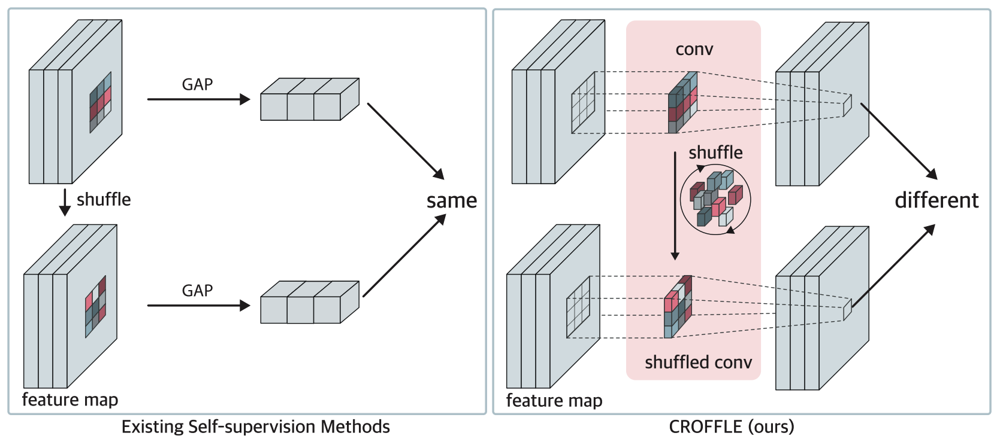
      

    

    

      <h3 class="pub-title">Randomly Shuffled Convolution for Self-Supervised Representation Learning</h3>
      
Youngjin Oh*, Minkyu Jeon*, Dohwan Ko, Hyunwoo J. Kim

      
Information Sciences 2023

      

        <a class="pub-btn pub-btn--arxiv" href="https://www.sciencedirect.com/science/article/pii/S0020025522013032">paper</a>
        <button type="button" class="pub-btn pub-btn--bibtex" data-toggle="collapse" data-target="#info2023" aria-expanded="false" aria-controls="info2023">bibtex</button>
      

      

        <pre><tt>@article{oh2023randomly,
  title={Randomly shuffled convolution for self-supervised representation learning},
  author={Oh, Youngjin and Jeon, Minkyu and Ko, Dohwan and Kim, Hyunwoo J},
  journal={Information Sciences},
  year={2023}
}</tt></pre>
      

    

  

  

    

      

        
      

    

    

      <h3 class="pub-title">Search-and-Attack: Temporally Sparse Adversarial Perturbations on Videos</h3>
      
Hwan Heo*, Dohwan Ko*, Jaewon Lee*, Youngjoon Hong, Hyunwoo J. Kim

      
IEEE Access 2021

      

        <a class="pub-btn pub-btn--arxiv" href="https://ieeexplore.ieee.org/stamp/stamp.jsp?tp=&arnumber=9592758&tag=1">paper</a>
        <button type="button" class="pub-btn pub-btn--bibtex" data-toggle="collapse" data-target="#access2021" aria-expanded="false" aria-controls="access2021">bibtex</button>
      

      

        <pre><tt>@article{heo2021search,
  title={Search-and-attack: temporally sparse adversarial perturbations on videos},
  author={Heo, Hwan and Ko, Dohwan and Lee, Jaewon and Hong, Youngjoon and Kim, Hyunwoo J},
  journal={IEEE Access},
  year={2021}
}</tt></pre>
      

    

  

  <h2 class="pub-section__title">
    📝
    Preprints
    
  </h2>
  

  

    

      

        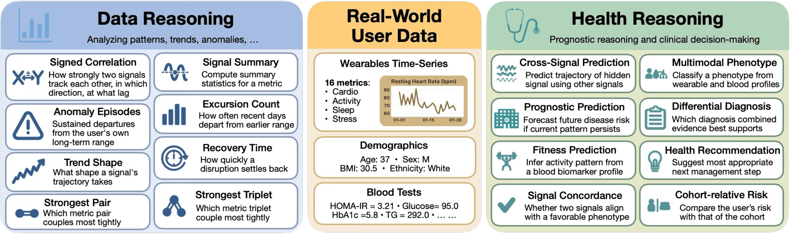
      

    

    

      <h3 class="pub-title">WearableQA: A Benchmark for Health Reasoning over Real-World Wearable Data</h3>
      
Ji Soo Lee, Xilun Chen, Pierce Chuang, Ashish Shenoy, Jason Wei, Dohwan Ko, Hyunwoo J. Kim, Benoit Corda

      
arXiv preprint 2026

      

        <a class="pub-btn pub-btn--arxiv" href="https://arxiv.org/abs/2609.05405">arxiv</a>
        <button type="button" class="pub-btn pub-btn--bibtex" data-toggle="collapse" data-target="#arxiv2026" aria-expanded="false" aria-controls="arxiv2026">bibtex</button>
      

      

        <pre><tt>@article{lee2026wearableqa,
  title={WearableQA: A Benchmark for Health Reasoning over Real-World Wearable Data},
  author={Lee, Ji Soo and Chen, Xilun and Chuang, Pierce and Shenoy, Ashish and Wei, Jason and Ko, Dohwan and Kim, Hyunwoo J. and Corda, Benoit},
  journal={arXiv preprint arXiv:2609.05405},
  year={2026}
}</tt></pre>
      

    

  

  

    

      

        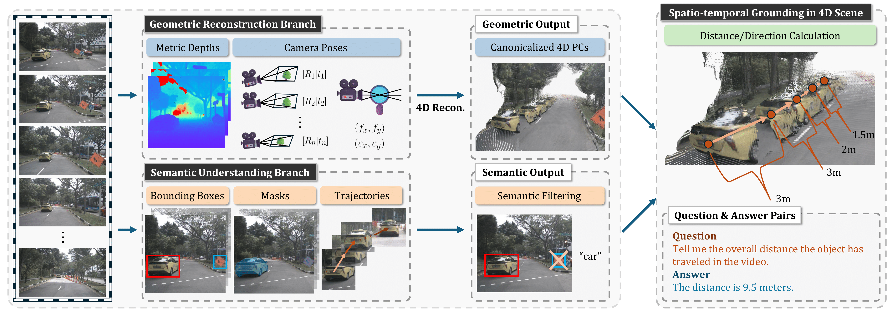
      

    

    

      <h3 class="pub-title">ST-VLM: Kinematic Instruction Tuning for Spatio-Temporal Reasoning in Vision-Language Models</h3>
      
Dohwan Ko*, Sihyeon Kim*, Yumin Suh, Vijay Kumar, Minseo Yoon, Manmohan Chandraker, Hyunwoo J. Kim

      
arXiv preprint 2025

      

        <a class="pub-btn pub-btn--arxiv" href="https://arxiv.org/abs/2503.19355">arxiv</a>
        <a class="pub-btn pub-btn--code" href="https://github.com/mlvlab/ST-VLM">code</a>
        <a class="pub-btn pub-btn--project" href="../projects/ST-VLM" target="_blank">project page</a>
        <button type="button" class="pub-btn pub-btn--bibtex" data-toggle="collapse" data-target="#arxiv2025" aria-expanded="false" aria-controls="arxiv2025">bibtex</button>
      

      

        <pre><tt>@article{ko2025st,
  title={St-vlm: Kinematic instruction tuning for spatio-temporal reasoning in vision-language models},
  author={Ko, Dohwan and Kim, Sihyeon and Suh, Yumin and Yoon, Minseo and Chandraker, Manmohan and Kim, Hyunwoo J and others},
  journal={arXiv preprint arXiv:2503.19355},
  year={2025}
}</tt></pre>
      

    

  

